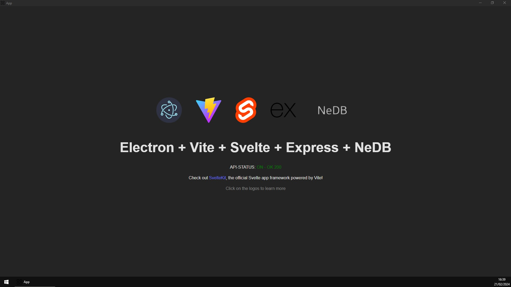

# Electron Svelte Express Boilerplate

This boilerplate provides a solid foundation for developing Windows applications using HTML, CSS, and JavaScript. While initially configured for Windows, it can be adapted for Linux applications as well.

The build will provide you with a portable version and a "setup.exe".

This application is a comprehensive "all-in-one" solution, which deploys all necessary services with a single command.

It is built upon:

- **Compiler**: Utilizes Electron for compiling the application.
- **Graphical Interface**: Employs Vite and Svelte to create a smooth and responsive user interface.
- **API**: Utilizes ExpressJS for seamless communication with the computer.
- **Database**: Implements NeDB, offering persistent storage in local files without the need for SQL.



## 🚧 | Prerequisites
- [Node.js >= 20](https://nodejs.org/en/download/)
- [yarn](https://classic.yarnpkg.com/lang/en/docs/install/#windows-stable)
## 📝 | Installation

- **Install requirements**
    ```bash
    yarn installation
    ```
    > This command installs the required dependencies by running "yarn install" in both the main project and the interface project.

- **Configuration**
    - Rename ".env_example" to ".env"
    - Environment variables:
    ```plaintext
    DEBUG=TRUE/FALSE        -   Enables or disables live changes view in Electron using "yarn dev"
    CONSOLE=TRUE/FALSE      -   Displays browser development tools in Electron using "yarn dev"
    ```

- **Development**
    > This command opens a window in your browser for previewing the Electron application.
    ```bash
    yarn dev
    ```
    > Alternatively, you can simply open the client using:
    ```bash
    yarn serve:client
    ```

- **Build**
    > This command builds the Svelte project (client) into a static folder. It then generates a "dist" folder with the "windows-unpacked" version and an "app-setup.exe" inside.
    ```bash
    yarn build
    ```
    > Alternatively, you can build the Svelte project in static version, with the "www" folder being named "interface":
    ```bash
    yarn build:client
    ```

## ℹ | Info
> **🔴Default ports of the aplication in dev mode:**

- Interface: 57805

- API: 57806